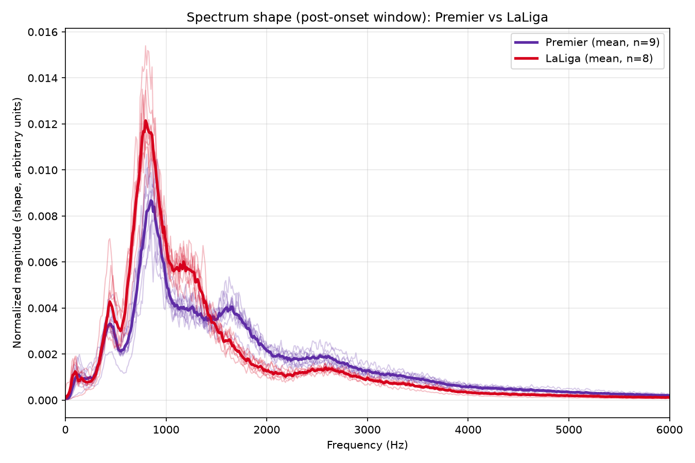
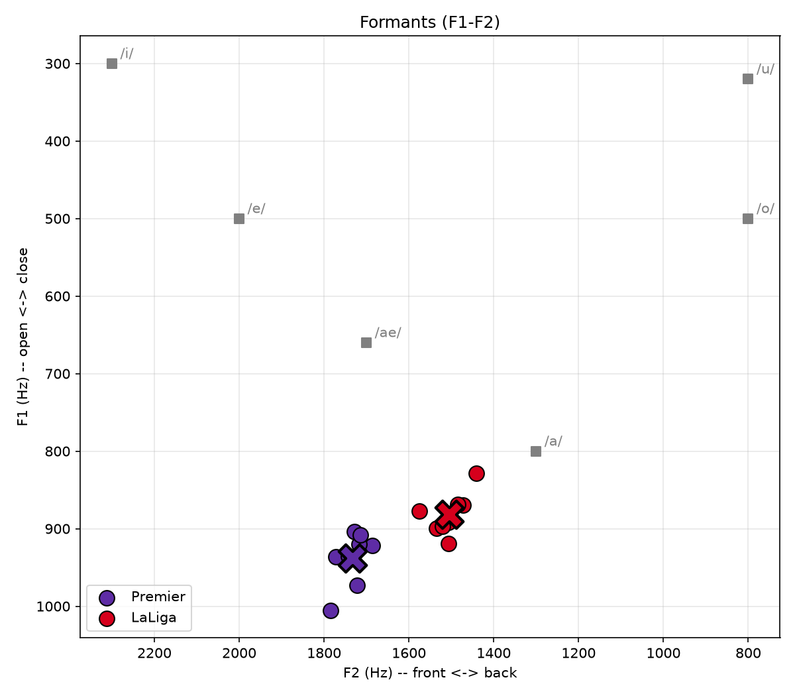
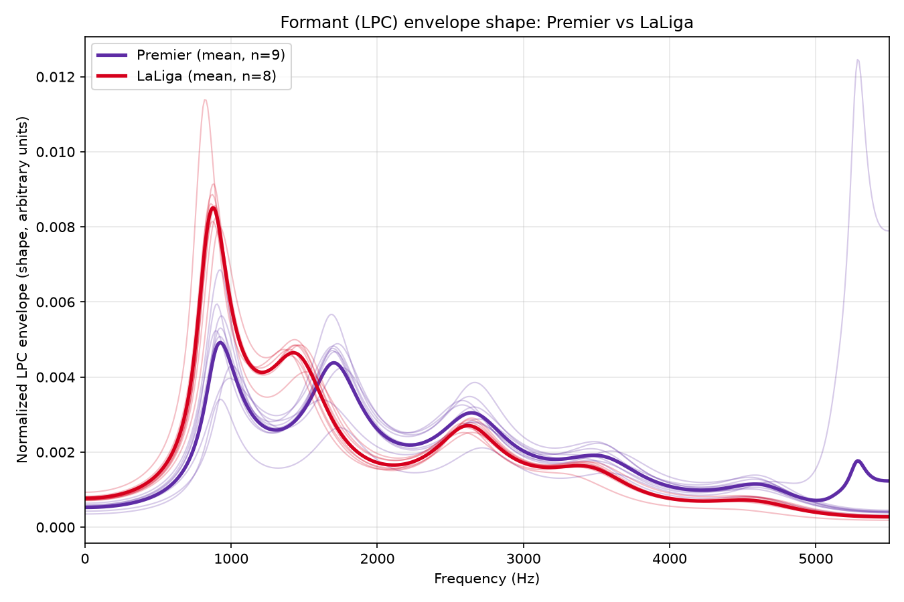

# プレミアリーグ vs ラ・リーガ ゴール時の歓声の音響比較

## 1. 背景・目的

プレミアリーグとラ・リーガのゴール時の歓声を聴き比べると、プレミアは「イェーイ」に近い明るい歓声、
ラ・リーガは「ウォオ」に近い低くこもった歓声に聞こえる、という印象があった。この違いを音響特徴量で
定量的に検証する。

## 2. 結論(先に要約)

サンプル数17件(プレミア9件・ラ・リーガ8件)の分析で、以下の点において**統計的に有意な差**が確認された。

- プレミアの歓声は**スペクトル的に明るい**(スペクトル重心・ロールオフ・帯域幅が有意に高い)
- フォルマント解析(F1・F2)でも、プレミアの方が**より前寄り・開口寄り**の母音特性を示した

これは最初の聴感上の印象(プレミア=「イェーイ」/明るい、リーガ=「ウォオ」/低く暗い)を裏付ける結果である。

F0(基本周波数)は、プレミアの方が高いという方向性は見られたものの、統計的有意水準には届かなかった。

## 3. データソース

**音源**: UEFA公式チャンネルの「The BEST Champions League Goals Of The 2025/26 Season」
(`https://youtu.be/NiPCDDNEZa0`)。プレミアリーグ・ラ・リーガ双方チームの2025/26シーズンのゴールが
収録された、実況なしのハイライト動画。

各ゴールの前後数秒程度の音声を、動画を通常どおり再生しながらシステムの音声出力をループバック録音する
方式で取得した。Youtubeの利用規約上、動画のダウンロードは許可されていないため。

対象は**すべてホームゴール**。アウェイゴールでは相手サポーターの反応が混ざり、単純比較が成立しない
ため。

### 対象ゴール一覧

**プレミアリーグ勢(n=9)**

| チーム | 動画内タイムスタンプ |
|---|---|
| ニューカッスル | 1:14 |
| リヴァプール | 5:51 |
| リヴァプール | 6:07 |
| アーセナル | 6:20 |
| マンチェスター・シティ | 14:59 |
| トッテナム | 18:37 |
| アーセナル | 21:13 |
| ニューカッスル | 22:38 |
| チェルシー | 28:17 |

**ラ・リーガ勢(n=8)**

| チーム | 動画内タイムスタンプ |
|---|---|
| アトレティコ・マドリード | 3:34 |
| レアル・マドリード | 5:09 |
| アトレティック・クルブ | 6:41 |
| アトレティコ・マドリード | 7:31 |
| レアル・マドリード | 11:26 |
| アトレティック・クルブ | 11:44 |
| バルセロナ | 12:04 |
| レアル・マドリード | 15:40 |

レアル・マドリードの3ゴールのうち1件は、録音後半にスタジアムの演出音(ジングル)が入り込んで
いたため該当区間を除いており、その結果ゴール後の音声が短くなっている。4章の分析で対象とする
ゴール後2秒間とする解析対象範囲に対し、約1.85秒分のデータしか確保できていない。

## 4. 分析

### 4.1 解析対象範囲の決定

今回の分析では、**ゴールの瞬間から2秒後までを解析対象範囲とする**。以降の各節の分析はすべて、
この範囲を切り出した音声を対象に行う。

この範囲を定めるには、まず基準となる「ゴールの瞬間」を特定する必要がある。しかし、これを人間の
主観的な判断だけに頼って特定すると、判断のブレが生じうる。そこで、以下の方法で候補を客観的に
絞り込んだうえで、人間が確認するという手順をとった。

「前後1秒ずつのスペクトル形状がどれだけ変化したか」(コサイン距離)を0.05秒刻みで計算し、局所的な
極大点を候補として列挙した。人間が動画と音声を確認したうえで、候補から1つを抽出した。いずれの
ゴールに関しても、この方法でゴールの瞬間を正しく検出できている。

この手法は「前後の音声の質の変化が最も大きい瞬間」を抽出できるため、ゴールによって歓声が盛り上がり
始めた瞬間を捉えていると解釈できる。音量が最大になる瞬間ではなくこの瞬間を基準にするのは、音量の
ピークを基準にすると、そこには既にチャンスシーンへの反応などゴール前の文脈が混ざっている場合が
あり、「ゴールへの反応」を測る基準点として不適切になりうるため。

### 4.2 スペクトル分析

歓声の音色が高域寄り(明るい)か低域寄り(こもった)かを調べるため、スペクトル分析を行う。
スペクトル分析とは、音に含まれる周波数成分ごとの強さの分布を求める手法である。**音のエネルギーが
低い周波数に集中しているほどこもった音色に近く、高い周波数まで伸びているほど明るい音色に
近づく。**以降のグラフ・指標も、この観点で読むとよい。

解析対象範囲を短い時間フレーム(1フレームあたり約93ミリ秒の幅を、約23ミリ秒ずつずらしながら
並べたもの。2秒間で87フレームになる)に分割し、フレームごとに周波数成分の強さを求める。1クリップ全体を代表する1つのスペクトルを得るため、この多数のフレームのスペクトルを
時間方向に平均する(これを「各クリップの平均スペクトル」と呼ぶ)。ただし、この時点では
クリップごとの録音音量の違いがそのまま残ってしまうため、各クリップの平均スペクトルを、値の
合計が1になるよう正規化する(音量の違いを取り除き、周波数ごとの相対的な分布の形だけを残す
処理)。これをさらに群ごとに(プレミアの9クリップ間、リーガの8クリップ間でそれぞれ)平均したものが
以下のグラフである。

800〜900Hz付近の山は両リーグに共通するが、リーガの方が高く鋭い。プレミアはこの山がやや低い一方、
1500〜2000Hz付近にもう一段の緩やかな盛り上がりがあり、2000Hz以降の裾もリーガより長く残る。

上記の図とは別に、以下の3つの指標もクリップごとに計算した(いずれもフレームごとに値を計算し、
その87個の平均をとったもので、上記の「平均スペクトル」から計算した値とは異なる)。

- **スペクトル重心**: 周波数を強さで重み付けした平均値。エネルギーがどの周波数付近に集中して
  いるかを表す1つの周波数
- **ロールオフ85%**: エネルギー全体の85%が、どの周波数以下に収まっているかを示す境界の周波数。
  高域への裾の長さを表す
- **スペクトル帯域幅**: 重心を中心に、エネルギーがどれだけ広い周波数範囲に散らばっているかを
  表す(重心からの散らばりの大きさ)

これら3指標について、Welchのt検定(等分散を仮定しない)でプレミア群とリーガ群を比較した結果が
以下:

| 指標 | プレミア (mean±SD) | リーガ (mean±SD) | p値 |
|---|---|---|---|
| スペクトル重心 | 2010.9 ± 95.8 Hz | 1579.4 ± 91.6 Hz | <0.0001 |
| ロールオフ85% | 3383.1 ± 214.4 Hz | 2655.9 ± 158.9 Hz | <0.0001 |
| スペクトル帯域幅 | 1599.8 ± 85.2 Hz | 1353.9 ± 66.8 Hz | <0.0001 |

いずれもプレミアが有意に高く、上記の図の形状差と対応する。**プレミアの歓声は高域成分が多く音色
として明るく、リーガは低域寄りでこもった/暗い音色**と言える。また、帯域幅は「音がどれだけ
純粋なトーンに近いか、それとも幅広い周波数を含む複雑・ノイズ的な音か」を表す、重心とは別の軸の
指標である。この差は、**リーガの歓声が特定の帯域に集中した、より単一的でまとまりのある音色で
あるのに対し、プレミアの歓声は幅広い帯域に分散した、より複雑・ノイズ的な音色である**ことを
示しており、上記の図でリーガの山がより鋭く、プレミアの山がより緩やかに見えることとも対応する。

### 4.3 フォルマント分析(母音特性)

歓声の母音的な音色(「ア」寄りか「イ」寄りかなど)を調べるため、フォルマント分析を行う。
フォルマント分析とは、声道の共鳴によって強調される周波数(フォルマント)を推定し、声の母音としての
特徴を捉える手法である。**F1は舌の高さ(開口度)に対応し、値が低いほど閉じた母音(「イ」「ウ」
寄り)、高いほど開いた母音(「ア」寄り)であることを示す。F2は舌の前後位置に対応し、値が高いほど
前寄りの母音(「イ」「エ」寄り)、低いほど後ろ寄りの母音(「オ」「ウ」寄り)であることを示す。**
以降のグラフ・指標も、この観点で読むとよい。

`praat-parselmouth`(PraatのPython版)のBurg法でF1・F2を推定した。この手法は、音声を「少数の
共鳴を持つ1つのフィルタ(声道)を音源が通過した結果」としてモデル化する**LPC(線形予測分析)**に
基づいており、その共鳴の周波数をフォルマントとして推定する。LPCは「1人の声道(1つの共鳴管)」の存在を
前提とした手法であり、群衆音は単一話者を前提としたLPC解析には理論上不向きだが、集団としての
共鳴の傾向を近似的に表していると解釈できる、という前提のもとで実施した(詳細は5章の限界を
参照)。

解析対象範囲を約10ミリ秒ごとの短いフレームに分割し(2秒間で195フレーム程度)、フレームごとに
F1・F2を推定する。ただし明らかにあり得ない値(F1は150〜1200Hz、F2は500〜3500Hzの範囲外)は
除外する。この多数のフレームの値を1クリップにつき1つの数値にまとめるため、中央値をとったものが
「クリップごとのF1・F2中央値」である(平均ではなく中央値を用いるのは、フォルマント推定が
時々大きく外れた値を出すことがあり、中央値の方がその影響を受けにくいため)。

クリップごとのF1・F2中央値を母音チャート上に散布したもの:

両リーグとも典型的な「エ」「オ」よりは開口母音「ア」に近い領域に集まっているが、プレミア(紫)の
方がやや「イ」寄り、リーガ(赤)の方がやや「オ」寄りに位置している。

F1・F2は、共鳴の強さを周波数ごとに表した曲線(スペクトル包絡)の山として抽出される値である。
ピーク位置(F1・F2の数値)だけでなく、包絡の形そのものを見るため、各クリップのスペクトル包絡
(librosa自前のBurg法LPCによる計算。parselmouthとは独立な実装であり、F1・F2の推定と完全に
同一の計算ではないことに注意)を計算し、群ごとに正規化平均したものが以下:

山の位置(横軸)がそのままF1・F2の値にあたる。1つ目の山(F1相当)は、プレミアが925〜950Hz付近、
リーガが850〜880Hz付近と山の位置がわずかに異なっており、プレミアの方がやや高い側にある。これは前段のF1中央値の分析と一致している。加えてリーガの方がこの山が高く鋭く、プレミアは低く緩やかである。これはリーガのほうが共鳴のエネルギーが集中して澄んだ響きに近く、プレミアのほうが共鳴のエネルギーが分散し輪郭のぼやけた響きに近いことを示す。スペクトル分析のときと同様に、リーガの歓声は比較的音がまとまっており、プレミアの歓声は比較的音が散らかっている、という傾向が共通して見られる。

2つ目の山(F2相当)は、プレミアが1600〜1700Hz付近、リーガが1400Hz付近と**山の位置そのものが異なっており**、プレミアの方がより高い周波数側にある――節冒頭の説明の通り、F2が高いほど前寄りの母音に近いことを示す。なお、F1の山で見られた高さ・鋭さの違いは、この山では目立って見られない。

なお、プレミア側の1クリップで
LPC推定が5300Hz付近で不安定なピークを作っており(平均線にもわずかに影響)、これはF1・F2の推定
では150〜3500Hzの範囲外として除外済みのためF1・F2の数値自体には影響していないが、この図を見る
際の注意点として記録しておく。

上記の図・チャートとは別に、クリップごとのF1・F2中央値についてWelchのt検定(等分散を仮定しない)
でプレミア群とリーガ群を比較した結果が以下:

| 指標 | プレミア (mean±SD) | リーガ (mean±SD) | p値 |
|---|---|---|---|
| F1中央値 | 947.3 ± 33.4 Hz | 888.7 ± 23.5 Hz | 0.0014 |
| F2中央値 | 1736.6 ± 32.4 Hz | 1498.7 ± 39.0 Hz | <0.0001 |

いずれも有意差があり、上記の図・チャートの傾向と対応する。相対的にはプレミアがより前寄り
(「エ」方向)、リーガがより後ろ寄り(「オ」方向)であり、**「イェー」対「ウォー」という最初の
印象の方向性と一致する**。

### 4.4 基本周波数(F0)

歓声の声の高さ(ピッチ)を調べるため、基本周波数(F0)を推定する。基本周波数とは、音の周期的な
繰り返しの速さから求まる、声の高さに対応する指標である。

pYINアルゴリズムで基本周波数(ピッチ)を推定した。pYINは各フレームについて、周期的な(はっきりした
高さを持つ)音かどうかを判定し、そう判定されたフレーム(有声フレーム)だけからF0を算出する
(有声と判定されたフレームの割合を「有声フレーム率」として記録した)。クリップごとのF0中央値を
Welchのt検定(等分散を仮定しない)でプレミア群とリーガ群を比較した結果が以下:

| 指標 | プレミア (mean±SD) | リーガ (mean±SD) | p値 |
|---|---|---|---|
| F0中央値 | 878.3 ± 19.8 Hz (n=8) | 878.6 ± 31.1 Hz | 0.982 |

プレミアはn=8(1クリップは有声フレーム率0%のため中央値を算出できず)。**有意差はなく、平均値も
ほぼ同じだった**。群衆のブロードバンドな歓声に対する推定自体が本質的に不安定な指標であり(5章参照)、この分析結果
からは、両リーグの歓声の音の高さに実際に差があるかどうかを判断できない。

### 4.5 ゼロ交差率

歓声がどれだけノイズ的な音色かを調べるため、ゼロ交差率を算出する。ゼロ交差率とは、波形が
正負をまたぐ頻度であり、値が高いほどノイズ性・高域成分が多いことを示す指標である。

クリップごとの値をWelchのt検定(等分散を仮定しない)でプレミア群とリーガ群を比較した結果が以下:

| 指標 | プレミア (mean±SD) | リーガ (mean±SD) | p値 |
|---|---|---|---|
| ゼロ交差率 | 0.130 ± 0.011 | 0.097 ± 0.005 | <0.0001 |

有意差があり、**プレミアの方がノイズ性・高域成分が多い**。4.2節のスペクトル形状の図で見られた、
プレミアが高域まで幅広く音を伸ばす傾向と対応する。

### 4.6 分析のまとめ

4.2〜4.5節の結果を横断的に見ると、**スペクトル分析とゼロ交差率という異なる手法による2つの分析で、
プレミアの方が高域寄り・ノイズ寄りという一貫した方向性**が出ている。また、フォルマント(F1・F2)
では、プレミアの方がより前寄り・開口寄りの母音特性を示した。これらはそれぞれ別の性質を測る
指標でありながら、いずれもプレミア=「イェーイ」/明るい、リーガ=「ウォオ」/低く暗いという
最初の聴感上の印象を裏付ける結果になっている。

一方、F0(基本周波数、いわゆる音の高さそのもの)については、pYINによる推定自体が不安定であり
(4.4節参照)、有意差の有無を含めて信頼できる結果は得られなかった。つまり今回の結果は、
「プレミアの方が声のピッチが高い」ということではなく、**ピッチとは別の軸である音色・音質
(周波数分布の偏り、母音の響き方、ノイズ性の度合い)において、プレミアとリーガの歓声には
系統的な違いがある**、と解釈するのが適切である。

## 5. 限界・注意点

- **サンプル数**: n=9 vs n=8 とまだ少ない。UEFA公式の「ベストゴール集」という性質上、
  派手で盛り上がったゴールに選抜されているバイアスがある可能性がある
- **フォルマント解析の妥当性**: LPC由来のフォルマント推定は本来1人の声道を前提とした手法。
  数万人が同時発声する群衆音への適用は、個々のフォルマントではなく「集団としてのスペクトル
  包絡のピーク」を見ていると理解すべきで、真の意味での音声学的フォルマントとは性質が異なる
- **F0(ピッチ)推定の不安定性**: pYINによるピッチ推定は、群衆の歓声のような非周期的・
  ブロードバンドな音には本質的に不向きであり、有声フレーム率(全フレームのうち、周期的な音
  として認識されたフレームの割合)はクリップごとに大きく不安定(0%〜92%)である。有声フレーム率
  が低いクリップでは、少数のフレームから計算された中央値が外れ値になりやすく、群間比較の
  結果自体の信頼性も低い
- **人手によるマークの限界**: ゴールの瞬間の指定は人間の判断に依存する。試合の文脈(ゴール前の
  チャンスシーンかどうか等)に依存する判断が必要なケースもあり、これは音声だけからは判別できない
  情報である
- **立ち上がりの瞬間の決め方の限界**: この基準点は、機械的な候補検出(スペクトル形状変化検出)の
  結果を人間が検証する形で決めており、完全に独立な自由入力ではない(プレミア・リーガ両群に同じ
  方法を平等に適用しているため、致命的な問題ではないと考えているが、解釈時に意識しておくべき点
  である)
- **単一シーズン・単一大会**: チャンピオンズリーグの試合に限定されているため、リーグ戦の
  通常運用時の雰囲気とは異なる可能性がある(観客動員、注目度などが平常時と異なる)

## 6. 今後の発展案

- サンプル数を増やす(通常のリーグ戦のハイライトから、実況なし音源を追加で探す)
- ベストゴール集ではなく、通常のフルマッチ映像から無作為にゴールを抽出し選抜バイアスを減らす
- フォルマント解析の妥当性を検証するため、個々のファンの声を近接マイクで収録したデータと比較する
- 複数人でマークを行い、人間の判断のばらつき自体を定量化する(クリップ内の一致率など)
